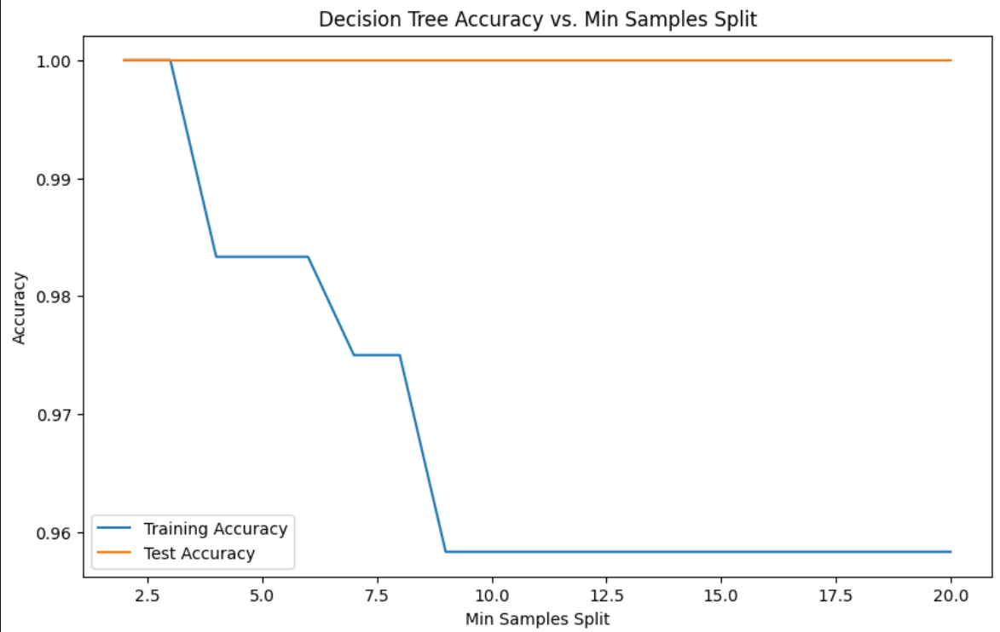

## Introduction

This analysis explores the use of a decision tree classifier on the car evaluation dataset. The goal is to predict a car's acceptability based on several attributes such as buying price, maintenance cost, number of doors, persons it can carry, the size of the luggage boot, and safety. The decision tree's performance is evaluated based on different tree depths and minimum samples split, offering insights into how these parameters influence model accuracy.

## Data Preparation

The car evaluation dataset comprises multiple features: 'buying', 'maint', 'doors', 'persons', 'lug_boot', 'safety', and a target variable 'class'. Initial data checks confirmed no missing values, and categorical variables were encoded using ordinal encoding to prepare the dataset for modeling.

## Model Training and Evaluation

The dataset was split into training and testing sets to evaluate the decision tree classifier's performance. The decision tree was initially trained using the "entropy" criterion. The model's accuracy was assessed on both the training and testing sets to understand its performance and generalization capability.

## Decision tree visualization

## Tuning Tree Depth and Min Samples Split

### Exploring Tree Depth

The impact of varying the tree depth was analyzed to understand its effect on model accuracy. A deeper tree might capture more information but risks overfitting, where the model performs well on the training data but poorly on unseen data.

### Adjusting Min Samples Split

Similarly, adjusting the minimum number of samples required to split an internal node (`min_samples_split`) was explored. This parameter helps control overfitting by requiring a minimum number of samples in a node before considering it for a split.

## Insights and Conclusions

### The Balancing Act: Tree Depth and Min Samples Split

Our analysis rigorously explored the influence of tree depth and minimum samples split on the accuracy of the decision tree classifier within the car evaluation dataset. It became evident that these parameters play a critical role in the model's ability to generalize well to unseen data. Specifically:

- **Tree Depth**: Deeper trees capture more detailed information about the training data, which can lead to a highly accurate model on this data. However, this granularity can cause the model to learn noise and outliers in the training set, manifesting as overfitting. Conversely, too shallow a tree might fail to capture important patterns, leading to underfitting. Our findings suggest that a moderate tree depth strikes an optimal balance, enabling the model to capture essential patterns in the data while avoiding the pitfalls of learning from noise.

- **Minimum Samples Split**: This parameter controls the minimum number of samples required to consider a node for splitting, acting as a regularization mechanism. A higher threshold ensures that splits are made only when sufficient evidence exists in the data, preventing the model from making decisions based on small, potentially noisy subsets. Our analysis indicates that setting a reasonable threshold for this parameter helps in mitigating overfitting, promoting a model that is more robust and performs better on unseen data.

### Strategic Insights for Model Improvement

1. **Model Complexity vs. Generalization**: The interplay between tree depth and minimum samples split underscores a fundamental principle in machine learning: the trade-off between model complexity and generalization capability. Optimal model performance is achieved by carefully calibrating the model's complexity to align with the underlying data structure, avoiding both overfitting and underfitting.

2. **Visualization for Insight**: The value of visualizing the decision tree cannot be overstated. It offers an intuitive understanding of how the model makes predictions, revealing the hierarchical importance of features and decision paths. This transparency aids in identifying areas for improvement, such as pruning overly specific branches or adjusting feature engineering to better capture the relationships in the data.

3. **Beyond Single Trees**: While decision trees offer a valuable starting point due to their simplicity and interpretability, our analysis also points to the potential benefits of exploring ensemble methods. Techniques like Random Forests and Gradient Boosting Machines can leverage multiple trees to enhance predictive performance and robustness, often outperforming single decision tree models on complex datasets.

4. **Iterative Refinement**: The process of tuning a decision tree exemplifies the iterative nature of machine learning model development. Continuous experimentation and refinement, guided by domain knowledge and model evaluation metrics, are essential for achieving high-performing models.

### Conclusion

The decision tree classifier analysis on the car evaluation dataset has provided rich insights into the nuanced effects of model parameters on performance. By judiciously adjusting tree depth and minimum samples split, we achieved a model that not only performs well on training data but also generalizes effectively to new data. These findings underscore the importance of understanding model dynamics and highlight the pathway to more sophisticated modeling approaches that can further enhance predictive accuracy and interpretability.
