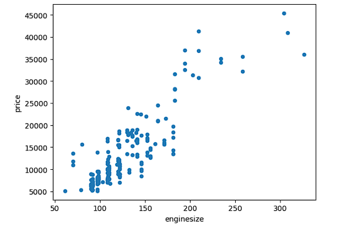
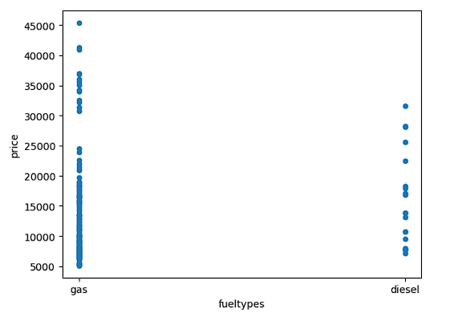
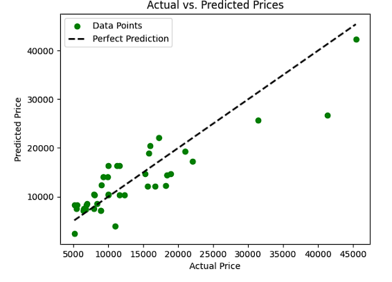
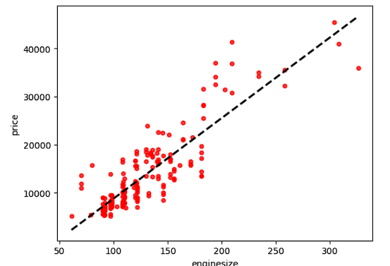

# Car Price Prediction Analysis

##  Objective
The goal of this project is to develop a model capable of predicting car prices using various car attributes. Through examining the relationship between car features and their prices, our aim is to construct a linear regression model that accurately estimates car prices, serving as a valuable resource for both buyers and sellers in the automotive market.

## Overview
Predicting car prices is a complex task that involves understanding the intricate relationships between various car attributes and how they collectively influence the final price. This analysis uses machine learning to model these relationships, providing valuable insights for manufacturers, buyers, and enthusiasts alike.

##  Dataset Insights

The dataset contains numerous features related to car specifications such as engine size, fuel type, body style, and more. Each entry represents a car, with the target variable being its price. Initial explorations aim to understand the data's structure, missing values, and statistical properties.

## Data Preparation and Exploration
The dataset encompasses diverse information about cars, detailed as follows:

| Attribute          | Description                                                                |
|--------------------|----------------------------------------------------------------------------|
| ID                 | Unique identifier for each car.                                            |
| Symboling          | Assigned rating indicating the car's risk level.                           |
| Name               | Car model name.                                                            |
| Fuel Types         | Type of fuel used by the car.                                              |
| Aspiration         | Engine aspiration method (standard or turbocharged).                       |
| Door Numbers       | Number of doors on the car.                                                |
| Car Body           | Style of the car body.                                                     |
| Drive Wheels       | Type of drive wheel configuration.                                         |
| Engine Location    | Placement of the engine within the car.                                    |
| Wheelbase          | Distance between front and rear wheels.                                    |
| Engine Size        | Engine displacement volume.                                                |
| Fuel System        | Type of fuel delivery system.                                              |
| Bore Ratio         | Diameter of engine cylinders.                                              |
| Stroke             | Length of the piston stroke.                                               |
| Compression Ratio  | Ratio of combustion chamber volume at different piston positions.          |
| Horsepower         | Engine power output.                                                       |
| Peak RPM           | Maximum engine revolutions per minute.                                     |
| City MPG           | Estimated city driving fuel efficiency.                                    |
| Highway MPG        | Estimated highway driving fuel efficiency.                                 |
| Price              | Car price.                                                                 |


## Detailed Model Training Procedure


```
### EDA:
Inspects the data, summarizes statistics, explores unique values, and identifies columns.
```python
# check the shape
df.shape
# first five rows of the dataframe
df.head()
# describe the dataframe with some statistical info
df.describe()
# check data types in the dataframe
df.info()
# check unique data for each feature in the dataframe
df.nunique()
# column names of the dataframe
df.columns
```
### Data Selection:
Selects numerical columns for analysis.
```python
numerical_columns = ['wheelbase', 'enginesize', 'boreratio', 'stroke', 'compressionratio', 'horsepower', 'peakrpm', 'citympg']
```
### Correlation Analysis:
Correlation analysis between the independent variables and the target variable "Price" is performed to identify the features most likely to influence car prices.
```python
# Calculate correlation coefficients with respect to "price"
correlation_with_price = df[numerical_columns].corrwith(df['price']).abs().sort_values(ascending=False)
```
### Creating a New DataFrame:
Creates a new DataFrame using 'enginesize' and 'price' for model training.
```python
x = new_df['enginesize']
y = new_df['price']
```
### Comparing Engine Size and Fuel Type with Price using Scatter Plot



### Splitting Data:
Splits the data into training and testing sets.
```python
x_train, x_test, y_train, y_test = train_test_split(x, y, test_size=0.2, random_state=0)
```
### Model Creation:
Initializes a Linear Regression model.
```python
model = LinearRegression()
```
### Model Training:
Fits the model to the training data.
```python
model.fit(x_train.values.reshape(-1,1), y_train)
```
### Evaluation metric - R2
- **R² Score Interpretation**: An R² score of 0.7825 is considered relatively high in many contexts, suggesting that the model has a strong predictive capability with respect to car prices. However, there's still room for improvement, as part of the variance remains unexplained by the current model.

### Plotting Actual vs. Predicted Values:
Visualizes the relationship between actual and predicted prices.

Plotting Regression Model Line:
Plots the regression line to visualize the model's fit.



Predicting Prices based on Engine Size:
Generates predicted prices based on engine size.




##  Insights and Model Efficacy
The analysis reveals key features that significantly influence car prices, providing a basis for strategic decisions regarding car design and marketing. The linear regression model, with its interpretability and simplicity, serves as a valuable tool for predicting car prices, though there is room for exploring more complex models for improved accuracy.

## Enhanced Findings and Insights

### Paramount Role of Engine Size
The investigation unequivocally establishes the preeminence of engine size in the valuation of automobiles. Among the spectrum of variables examined, engine size emerges with the most pronounced correlation to the vehicle's market price. This discovery underscores the critical influence of engine size on car pricing, distinguishing it as a pivotal feature in predictive analytics.

### Model Performance Evaluation
The linear regression analysis yields an R-squared value approaching 0.78, signifying a robust model performance. This statistic elucidates that the model successfully captures a substantial fraction of the variability in car prices, reflecting its adeptness in making accurate predictions. The model's efficacy in delineating price determinants illustrates its potential as a reliable tool in predictive analysis.

### Insights on Price Prediction
The model's proficiency in mirroring the actual price dynamics within the automotive market is noteworthy. Its capability to closely match real-world pricing, as evidenced by the evaluative metrics and illustrative visualizations, highlights its practical applicability. Stakeholders can leverage the model's insights, particularly the identified influence of engine size, to navigate price estimations more effectively.

The thorough analytical approach adopted in this study culminates in a robust predictive model for car prices, spotlighting engine size as a key determinant. This enhanced understanding facilitates a more nuanced appreciation of market dynamics and aids in strategic planning and decision-making processes.

### Additional Findings

- **Influence of Fuel Type:** Preliminary exploration suggests that fuel type, categorized into petrol, diesel, and others, also bears relevance to car pricing. Future analyses could further quantify this relationship, potentially integrating it into the predictive model to refine accuracy.
- **Impact of Technological Features:** Modern vehicles equipped with advanced technological features tend to command higher prices. Incorporating variables representing these features could offer a more comprehensive view of price determinants, suggesting an avenue for future model enhancement.
- **Geographical Variations:** The analysis acknowledges potential geographical influences on car prices. Market trends and consumer preferences across different regions could affect pricing strategies, indicating a multifaceted aspect of price determination yet to be explored.

These findings pave the way for expanded research, promising a deeper dive into the factors influencing car prices and the refinement of predictive models to accommodate a broader range of determinants.


## Future Work

Future analyses could explore more sophisticated machine learning models such as ensemble methods or neural networks to enhance predictive performance. Additionally, further feature engineering and the inclusion of more granular data could uncover deeper insights into the factors affecting car prices.


